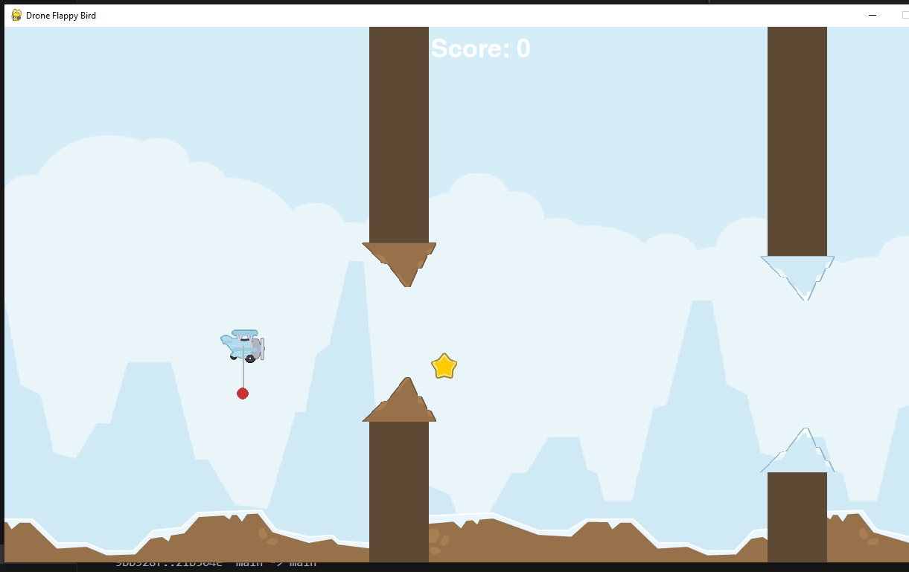

Drone Navigation Sim (Drone Flappy Bird)
A 2D side-scrolling game built from scratch in Python and Pygame, evolving the "Flappy Bird" concept into a challenging, physics-based drone navigation simulation. The primary goal is to pilot a drone carrying an unstable, suspended mass through a procedurally generated and dynamic environment.

Key Features
Advanced 2D Physics Engine:

Thrust & Momentum Model: The drone has mass, drag, and momentum, requiring force-based control rather than simple movement.

Coupled-Pendulum Simulation: A suspended mass is simulated in real-time, applying both linear (pull) and rotational (torque) forces back onto the drone, creating dynamic instability.

Physical Reactions: The pendulum mass realistically bounces off obstacles, creating large, destabilizing swings that the player must counteract.

Dynamic Environment:

Wind System: The world's scroll speed periodically changes to simulate headwinds (slowing the game) and tailwinds (speeding it up).

Procedural Generation: The game generates an endless, non-repetitive series of obstacles with randomized gaps and types, ensuring high replayability.

Multiple Obstacle Types: The game features three distinct obstacle classes that are introduced as the player's score increases:

Pillars: Standard top/bottom obstacles with randomized gaps.

Floating Rocks: Single, mid-screen obstacles to dodge.

Puffs: Smaller, floating obstacles that add to the visual clutter and challenge.

Complete Game Loop & UI:

A full state machine manages the "Get Ready," "Playing," and "Game Over" states.

The UI is built with graphical assets, including a medal system (Bronze, Silver, Gold) and a star counter to reward high performance.

Collectibles: Stars randomly spawn within obstacle gaps, rewarding risky maneuvers with bonus points.

Controls
Move Up: UP Arrow or W

Move Down: DOWN Arrow or S

Start / Restart: SPACEBAR

How to Run: 
Clone the repository.

Ensure you have Python and Pygame installed (pip install pygame).

Run the main file: python main.py

Technologies Used
Python
Pygame (for graphics, input, and timing)